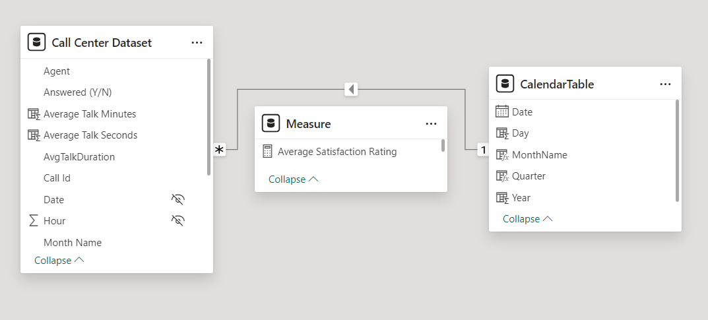
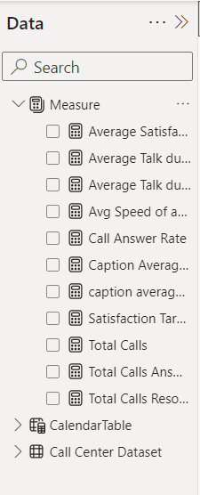
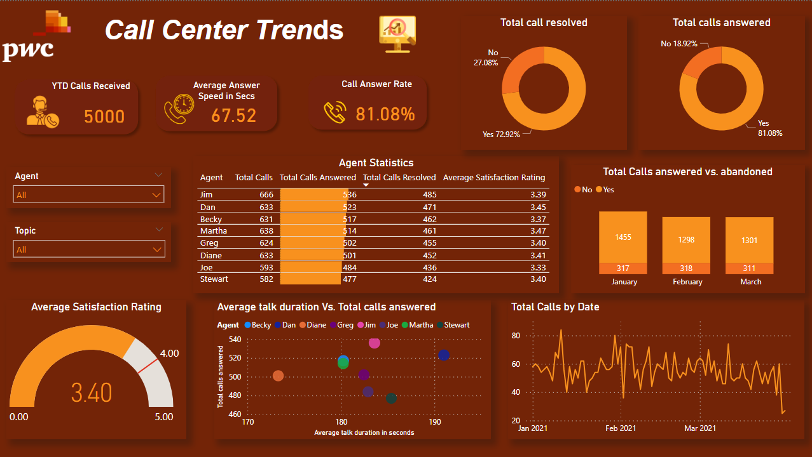

# Call Center Trends PowerBI Report
## Overview
This PowerBI report provides insights into call center trends, focusing on key performance indicators (KPIs) and metrics relevant to a telecom company. The report offers a high-level summary of various metrics related to call center performance, including call volume, speed of answer, agent performance, and more.

## Dataset
The dataset used for this report contains information such as call details, agent performance, call types, and other relevant metrics. Each record represents a call received or handled by the call center.

## Visualizations Used
Cards,gauge chart, line chart, table, column chart, donut chart, scatterplot.

## Key Metrics
- Overall Customer Satisfaction
- Overall Calls Answered/Abandoned
- Calls by Time
- Average Speed of Answer
- Agent's Performance Quadrant (average handle time vs. calls answered)

## Usage
- **Data Import:** Import the provided dataset into PowerBI.
- **Data Preparation:** Clean and shape the data as per the instructions.
- **Report Creation:** Use the provided DAX measures to create visualizations.
- **Interactivity:** Utilize slicers and filters for interactive analysis.
- **Insights:** Analyze the visualizations to gain insights into call center trends.

## Credits
This report was created by Suraj Balraj as part of the PwC PowerBI virtual case experience.
